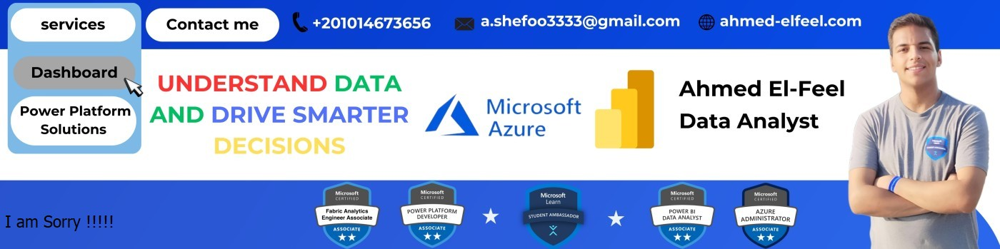

  

<!-- Header Section -->

  

<h1 align="center">👋 Hi, I'm Ahmed Sherif El-Feel</h1>
<h3 align="center">🚀 BI Analyst | Microsoft Fabric Engineer | Power BI Enthusiast</h3>

💡 Passionate about turning raw data into business insights using Power BI, Microsoft Fabric, and Power Platform tools.  
📊 Dedicated to delivering clean data models, automated workflows, and stunning dashboards.

---

### 🧠 About Me
- 🧩 **BI Analyst & Microsoft Fabric Engineer**
- 📈 Skilled in **Power BI, DAX, Power Query, and Data Modeling**
- ☁️ Working with **Microsoft Fabric, Lakehouses, and Power Platform**
- ⚙️ Automating reports using **Power Automate** and **Power Apps**
- 📍 Based in Egypt
- 🚀 Always exploring new ways to make data more meaningful

---

### ⚙️ My Tech Stack

  
  
  
  
  
  
  

---

### 🧩 What I Love Building
- 📊 Interactive Power BI dashboards that tell a story  
- 🧱 Data pipelines and Lakehouses in Microsoft Fabric  
- ⚡ Automated data refreshes with Power Automate  
- 🖥️ Professional, pixel-perfect BI visuals  

---

### 🌍 Connect With Me

  
  

---

### 📈 GitHub Stats

  

---

### 🧭 Fun Fact
> “Data without insight is noise — but with the right dashboard, it becomes a story that drives action.”
